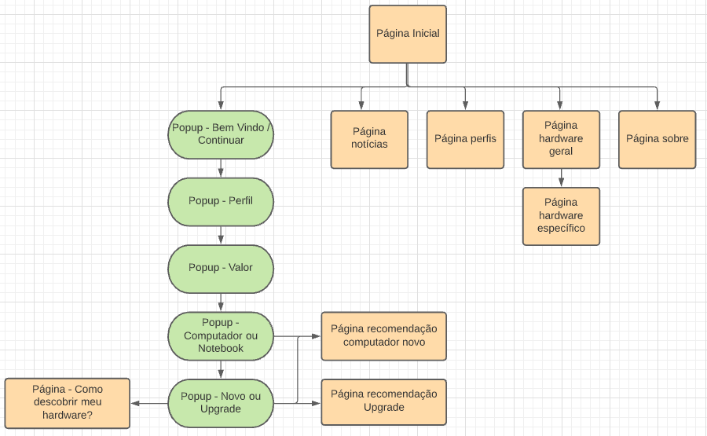
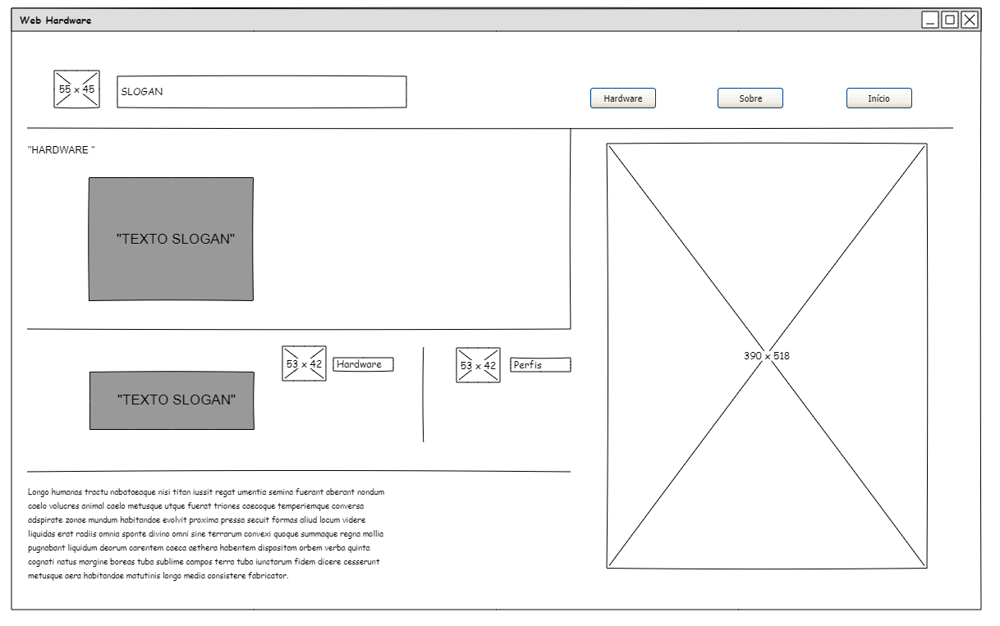
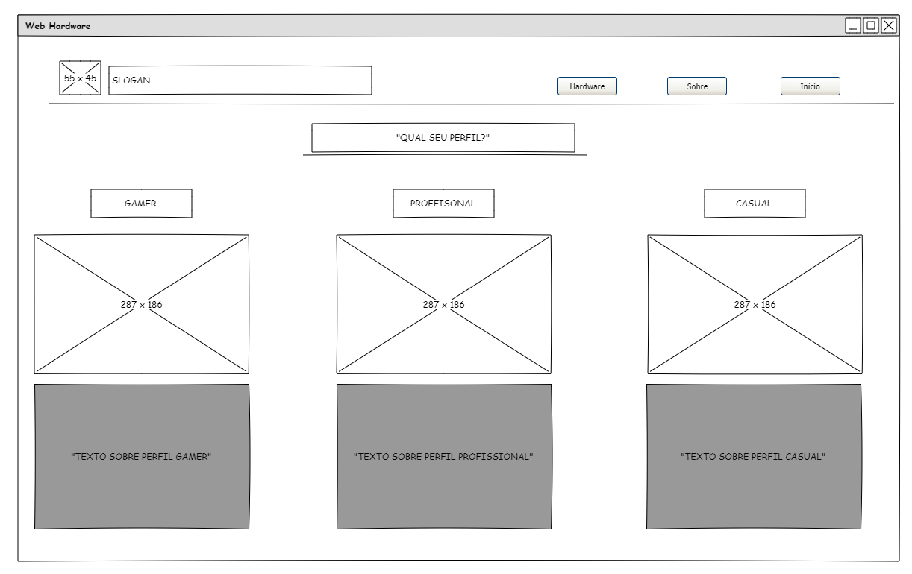
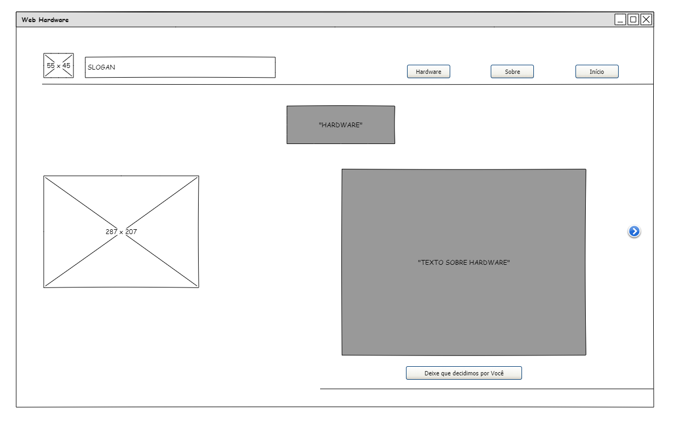
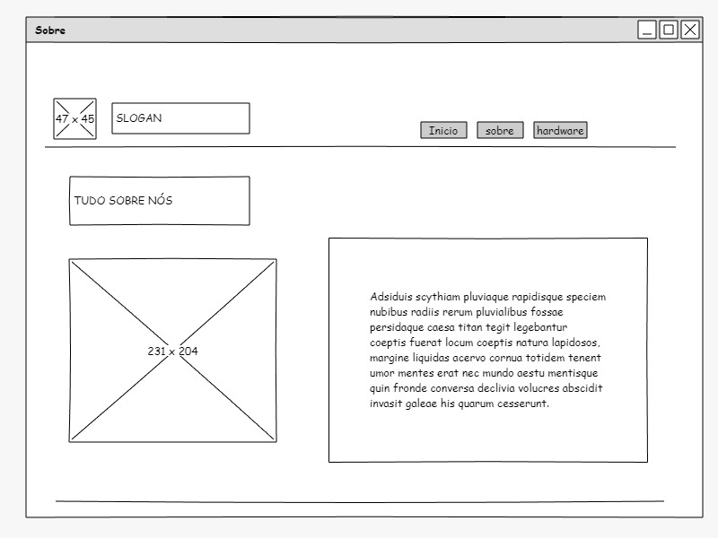
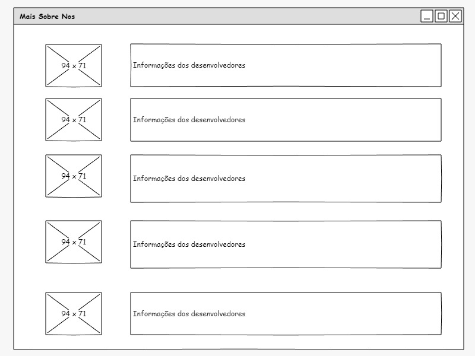

# Projeto de Interface

O projeto possui uma atenção especial quanto a usabilidade acessível e intuitiva para usuários pouco experientes, proporcinando um acesso simplificado às funcionalidades da aplicação. Assim, o site segue um design gráfico padronizado, age responsivamente em telas de diferentes tamanhos, dá destaque para elementos interativos e usa diversas técnicas para prevenção de erros do usuário.

## User Flow

 A imagem abaixo mostra o fluxo de interação do usuário pelas telas do sistema, essas que serão detalhadas na próxima seção. 

## Wireframes

#### Página Principal

#### Qual o seu perfil?

#### Hardwares

#### Explicação Hardware Individual

#### Sobre

#### Mais sobre nós

#### Decidimos por você
