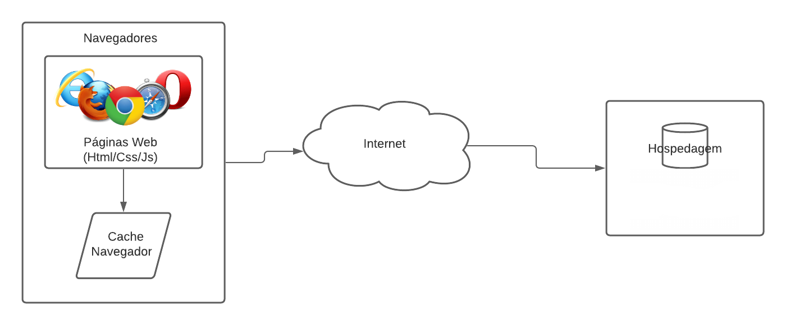

# Arquitetura da Solução

Nesta seção serão apresentados os detalhes estruturais da solução, tratando de diagrama de componentes, tecnologias utilizadas e hospedagem. 

## Diagrama de componentes

Diagrama que permite a modelagem física de um sistema, através da visão dos seus componentes e relacionamentos entre os mesmos.

Os componentes que fazem parte da solução são apresentados na figura abaixo.

 Arquitetura da Solução

A solução implementada conta com os seguintes módulos:
- **Navegador** - Interface básica do sistema  
  - **Páginas Web** - Conjunto de arquivos HTML, CSS, JavaScript e imagens que implementam as funcionalidades do sistema.
   - **Cache** - Salvar preferências do usuários e as informações necessárias para fornecer as recomendações personalizadas.
 - **Hospedagem** - local na Internet onde as páginas são mantidas e acessadas pelo navegador. 

## Tecnologias Utilizadas

As linguagens utilizadas foram [HTML](https://www.w3.org/html/), [CSS](https://www.w3.org/Style/CSS/Overview.en.html) e [Javascript](https://www.javascript.com/).

O [VisualStudioCode](https://code.visualstudio.com/) foi escolhido porque ele é um software gratuito, leve e personalizável através de extensões.

O [Discord](https://discord.com/) foi utilizado pois oferece várias funcionalidades além da troca de mensagens, como organização de canais(utilizadas para conversas), automação com bots e compartilhamento de tela.

O [Figma](https://www.figma.com/) e [Pencil Project](https://pencil.evolus.vn/) foram usados por serem ferramentas completas, que entregam várias possibilidades de criação de *layouts*

O [Lucidchart](https://www.lucidchart.com/pages/pt) foi escolhido para o desenvolvimento de diagramas pois é uma ferramenta versátil e fácil de se utilizar.

O [Git](https://git-scm.com/), [Github](https://github.com) e [GitKraken](https://www.gitkraken.com/) auxiliam no versionamento como foi exposto no [Controle de Versão](#Controle-de-Versão).

## Hospedagem

Para hospedagem utilizamos o [Github Pages](https://pages.github.com/), por ser integrado com o Github, gratuito e permitir uma adaptação direta do projeto local para o servidor. O site está hospedado sob o link https://gilidio8.github.io/pmv-ads-2021-1-e1-proj-web-t1-web-hardware-main/Documenta%C3%A7%C3%A3o%20Projeto%20Web%20Hardware/src/html/index.html.

