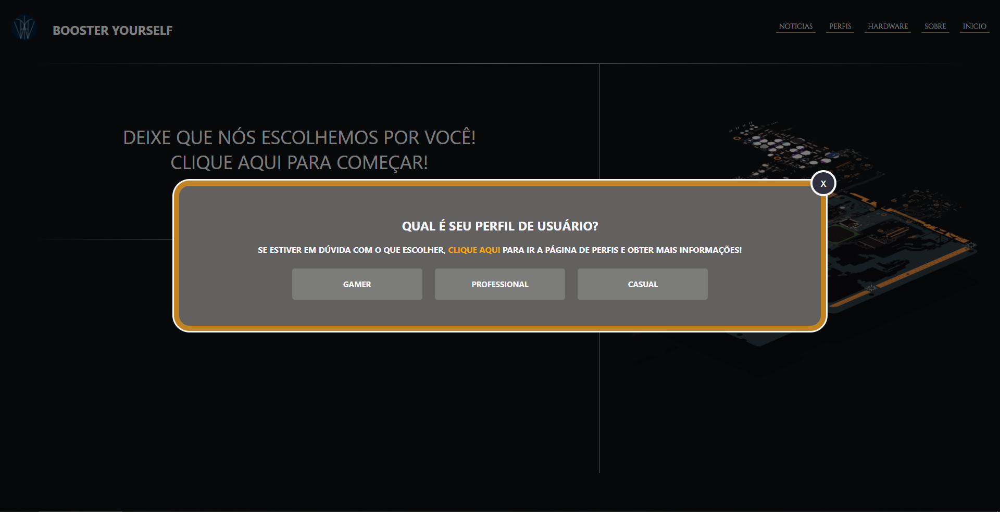
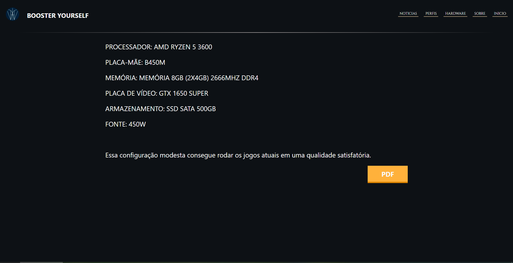
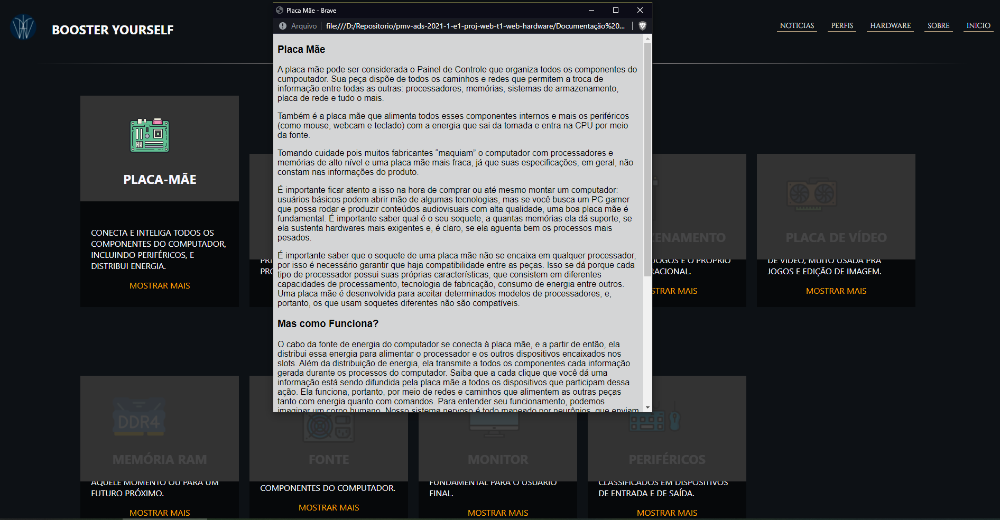
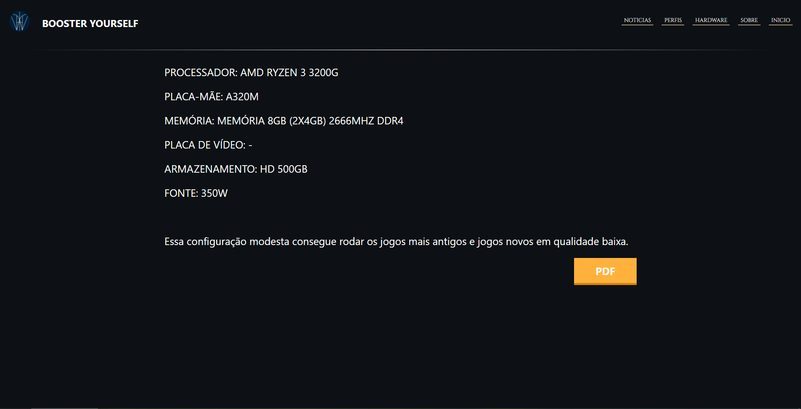
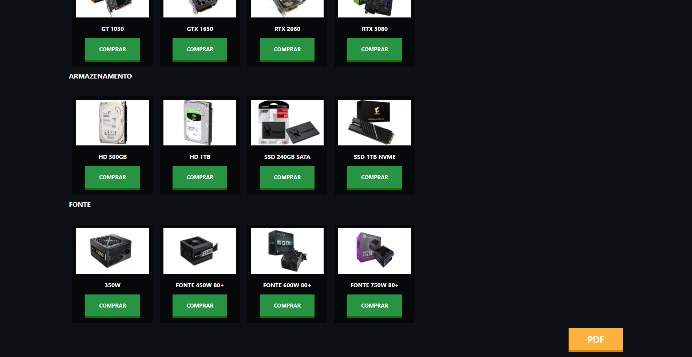
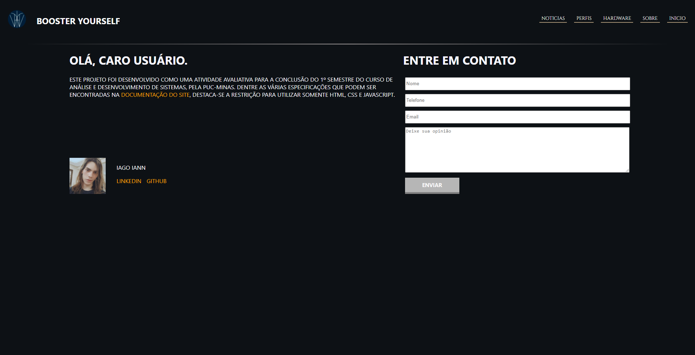

# Programação de Funcionalidades

## Popup com questionário sobre perfil do usuário (RF-01)

Os popups na tela inicial permitem o usuário informar seu perfil, que será salvo no localstorage do navegador.

#### Artefatos de funcionalidade
 - index.html
 - index.css
 - popup.css
 - global.js

#### Instruções de Acesso
1. Acesse a página inicial do site.
2. O popup irá aparecer automaticamente.
3. Seleciona alguma das opções oferecidas em cada popup.

## Popup com formulário sobre o hardware atual do usuário (RF-02)

O popup com formulário sobre hardware permite o usuário informar os componentes de seu computador atual, e essas informações serão salvas no localstorage do navegador.

#### Artefatos de funcionalidade
 - index.html
 - index.css
 - popup.css
 - global.js

#### Instruções de Acesso
1. Acesse a página inicial do site.
2. O popup irá aparecer automaticamente.
3. Seleciona alguma das opções oferecidas em cada popup.
4. No popup 'Você gostaria de um computador novo ou melhorar seu computador atual (upgrade)?' escolha a opção 'upgrade'.
5. Preencha o formulário e clique em 'Enviar os seus componentes'.

## Indicação de componentes (RF-03)

As telas de indicação de hardware exibem para o usuário uma recomendação baseada em seu perfil e hardware atual.

Opção novo.

Opção upgrade.

#### Artefatos de funcionalidade
 - escolha.css
 - escolhaUpgrade.css
 - relatorio.js

#### Instruções de Acesso
1. Acesse a página inicial do site.
2. O popup irá aparecer automaticamente.
3. Seleciona alguma das opções oferecidas em cada popup.
4. No popup 'Você gostaria de um computador novo ou melhorar seu computador atual (upgrade)?' escolha alguma das opções.
5. Caso a escolha seja 'novo', aguarde a página de recomendação ser carregada. Caso a escolha seja 'upgrade', preencha o formulário e clique em 'Enviar os seus componentes', então aguarde a página de recomendação ser carregada.

## Explicação Hardware (RF-04)

A tela de explicação de hardware permite o usuário aprender mais sobre os componentes mais relevantes do computador.

Hardware Geral.

Hardware Específico.

#### Artefatos de funcionalidade
 - hardware.html
 - hardware.css
 - hardware.js

#### Instruções de Acesso
1. Acesse a página inicial do site.
2. Pelo menu de navegação, vá na seção 'Hardware'.
3. Caso queira ver informações específicas de cada hardware, clique em 'Mostrar mais'.

## Relatório (RF-05)

O relatório permite ao usuário salvar a recomendação que recebeu para uso posterior.

Relatório Novo

Relatório Upgrade

#### Artefatos de funcionalidade
 - escolha.html
 - escolhaUpgrade.html
 - escolha.css
 - escolhaUpgrade.css
 - relatorio.js

#### Instruções de Acesso
1. Acesse a página inicial do site.
2. O popup irá aparecer automaticamente.
3. Seleciona alguma das opções oferecidas em cada popup.
4. No popup 'Você gostaria de um computador novo ou melhorar seu computador atual (upgrade)?' escolha alguma das opções.
5. No final da página terá o botão 'PDF', clique nele para gerar o relatório.

## Menores preços (RF-06)

Na tela de recomendação de upgrade, o usuário pode ter acesso aos melhores preços para cada componente recomendado.

#### Artefatos de funcionalidade
 - escolhaUpgrade.html
 - escolhaUpgrade.css
 - relatorio.js

#### Instruções de Acesso
1. Acesse a página inicial do site.
2. O popup irá aparecer automaticamente.
3. Seleciona alguma das opções oferecidas em cada popup.
4. No popup 'Você gostaria de um computador novo ou melhorar seu computador atual (upgrade)?' escolha a opção 'upgrade'.
5. Preencha o formulário e clique em 'Enviar os seus componentes'.
6. Aguarde a página carregar. Clique no botão 'Comprar' para o hardware desejado.

## Fale Conosco (RF-07)

A tela 'Sobre' possui um formulário que permite o usuário entrar em contato com os administradores do sistema.

#### Artefatos de funcionalidade
 - sobre.html
 - sobre.css
 - sobre.js

#### Instruções de Acesso
1. Acesse a página inicial do site.
2. Pelo menu de navegação, vá na seção 'Sobre'.
3. Preencha o formulário 'Entre em contato' e clique em enviar.
